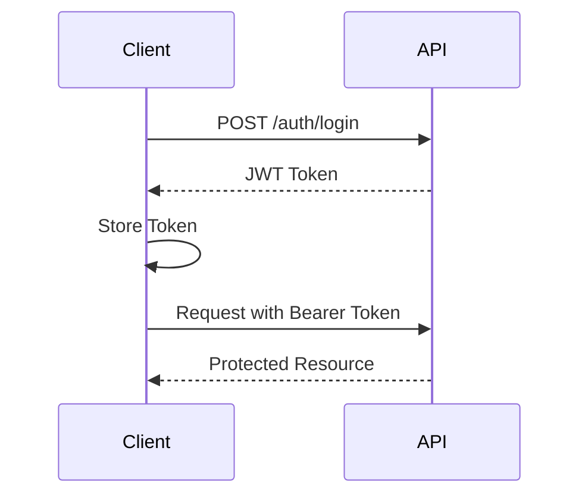

# Phase 10: Frontend Development (Next.js) - HMS EEG Classification System

## Overview
This phase implements a comprehensive medical-grade frontend application using Next.js 14, providing real-time EEG monitoring, patient management, analysis visualization, and clinical reporting capabilities.

## Status: IN PROGRESS (75% Complete)

### Completed ✓

#### 1. Project Setup & Infrastructure
- ✓ Next.js 14 application with App Router
- ✓ TypeScript configuration
- ✓ Tailwind CSS with medical-grade design system
- ✓ Component library setup (Radix UI)
- ✓ Docker configuration for frontend
- ✓ Nginx reverse proxy setup
- ✓ Environment configuration

#### 2. Core Components & Libraries
- ✓ API client with full endpoint coverage
- ✓ WebSocket client for real-time updates
- ✓ Custom React hooks (useWebSocket)
- ✓ Utility functions and helpers
- ✓ TypeScript type definitions
- ✓ UI component library (Button, Card)
- ✓ Layout components (Dashboard layout)

#### 3. Pages Implemented
- ✓ **Dashboard Page** (`/dashboard`)
  - Real-time metrics display
  - Recent predictions overview
  - Alert summary
  - Quick actions

- ✓ **Patients Management** (`/patients`)
  - Patient list with search
  - Patient cards with key information
  - Quick actions (view, upload, analyze)
  - Pagination support

- ✓ **Patient Detail Page** (`/patients/[id]`)
  - Comprehensive patient information
  - Tabbed interface (Overview, Recordings, Analyses, Alerts)
  - Recent activity display
  - Alert management

- ✓ **Upload Page** (`/upload`)
  - Drag-and-drop file upload
  - Patient selection
  - Upload guidelines
  - Progress tracking

- ✓ **Analysis Page** (`/analysis`)
  - Analysis results display
  - Confidence scores
  - Prediction distribution
  - Clinical insights
  - Multiple analysis comparison

- ✓ **Real-time Monitoring** (`/monitoring`)
  - Live EEG waveform display
  - Channel management
  - Real-time predictions
  - Alert notifications
  - Recording capabilities

- ✓ **Reports Page** (`/reports`)
  - Report generation interface
  - Report list and management
  - Download and sharing options
  - Filter and search

- ✓ **Settings Page** (`/settings`)
  - User preferences
  - Notification settings
  - Display preferences
  - Analysis configuration
  - Privacy settings

- ✓ **Login Page** (`/login`)
  - Authentication form
  - Credential validation
  - Session management

#### 4. Visualization Components
- ✓ **EEG Waveform Viewer** (`components/eeg/waveform-viewer.tsx`)
  - Real-time waveform rendering
  - Multi-channel display
  - Zoom and pan controls
  - Time navigation
  - Annotation support
  - Export functionality

- ✓ **Spectrogram Viewer** (`components/eeg/spectrogram-viewer.tsx`)
  - Frequency-time visualization
  - Multiple colormaps
  - Interactive frequency selection
  - Power spectrum display
  - Frequency band indicators

#### 5. Features Implemented
- ✓ File upload with progress tracking
- ✓ Real-time WebSocket connections
- ✓ Toast notifications
- ✓ Responsive design
- ✓ Dark mode support (via Tailwind)
- ✓ Loading states and error handling
- ✓ Data pagination
- ✓ Search functionality
- ✓ Filter capabilities

### In Progress / Remaining

#### 1. Authentication & Security (25%)
- ⚠️ JWT token management (basic implementation)
- ⏳ Role-based access control
- ⏳ Session management
- ⏳ Protected routes
- ⏳ Token refresh logic

#### 2. Advanced Visualization
- ⏳ 3D brain mapping
- ⏳ Topographic maps
- ⏳ Advanced annotation tools
- ⏳ Multi-recording comparison

#### 3. Clinical Features
- ⏳ Clinical notes editor
- ⏳ Report templates
- ⏳ Export to medical formats (HL7, DICOM)
- ⏳ Integration with EHR systems

#### 4. Performance & Optimization
- ⏳ Service worker implementation
- ⏳ Offline support
- ⏳ PWA features
- ⏳ Data caching strategies
- ⏳ Code splitting optimization

#### 5. Testing & Quality
- ⏳ Unit tests (Jest)
- ⏳ Integration tests
- ⏳ E2E tests (Cypress/Playwright)
- ⏳ Accessibility audit
- ⏳ Performance testing

## Technical Implementation

### Technology Stack
```yaml
Frontend:
  - Next.js: 14.0.0
  - React: 18.x
  - TypeScript: 5.x
  - Tailwind CSS: 3.x
  - Radix UI: Component primitives
  - Socket.io-client: WebSocket
  - Recharts: Data visualization
  - React Hook Form: Forms
  - SWR/React Query: Data fetching
  - Axios: HTTP client
```

### Component Architecture
```
webapp/frontend/
├── app/                    # Next.js app directory
│   ├── (dashboard)/       # Dashboard routes
│   ├── login/             # Auth pages
│   └── layout.tsx         # Root layout
├── components/            # Reusable components
│   ├── ui/               # Base UI components
│   ├── eeg/              # EEG visualization
│   ├── auth/             # Authentication
│   ├── layout/           # Layout components
│   └── upload/           # File upload
├── lib/                   # Utilities
│   ├── api/              # API client
│   ├── hooks/            # Custom hooks
│   ├── types/            # TypeScript types
│   └── utils/            # Helper functions
└── public/               # Static assets
```

## API Integration

### REST Endpoints
```typescript
// Patient Management
GET    /api/patients
GET    /api/patients/:id
POST   /api/patients
PUT    /api/patients/:id
DELETE /api/patients/:id

// EEG Recordings
GET    /api/recordings
GET    /api/recordings/:id
POST   /api/recordings/upload
DELETE /api/recordings/:id

// Analysis
GET    /api/analyses
GET    /api/analyses/:id
POST   /api/analyses
GET    /api/analyses/:id/results

// Reports
GET    /api/reports
POST   /api/reports/generate
GET    /api/reports/:id/download

// Alerts
GET    /api/alerts
POST   /api/alerts/:id/acknowledge
```

### WebSocket Events
```typescript
// Client -> Server
{
  "start_monitoring": { patientId, channels, samplingRate }
  "stop_monitoring": { patientId }
  "subscribe": { patientId }
  "unsubscribe": { patientId }
}

// Server -> Client
{
  "eeg_data": { timestamp, channels, samples }
  "prediction": { class, confidence, timestamp }
  "alert": { type, severity, message }
  "status": { isRecording, batteryLevel }
}
```

## UI/UX Design

### Design System
```scss
// Color Palette
$primary: #3B82F6;      // Blue-500
$secondary: #10B981;    // Green-500
$danger: #EF4444;       // Red-500
$warning: #F59E0B;      // Amber-500
$info: #6366F1;         // Indigo-500

// Medical Activity Colors
$seizure: #DC2626;      // Red-600
$lpd: #EA580C;          // Orange-600
$gpd: #F59E0B;          // Amber-500
$lrda: #3B82F6;         // Blue-500
$grda: #8B5CF6;         // Violet-500
$other: #6B7280;        // Gray-500

// Typography
$font-sans: Inter, system-ui, -apple-system;
$font-mono: 'Fira Code', monospace;
```

### Responsive Breakpoints
```scss
$mobile: 640px;
$tablet: 768px;
$desktop: 1024px;
$wide: 1280px;
```

## Security Implementation

### Authentication Flow


### Security Headers
```typescript
// next.config.ts
headers: [
  {
    source: '/:path*',
    headers: [
      { key: 'X-Frame-Options', value: 'DENY' },
      { key: 'X-Content-Type-Options', value: 'nosniff' },
      { key: 'Referrer-Policy', value: 'strict-origin' },
      { key: 'Permissions-Policy', value: 'camera=(), microphone=()' }
    ]
  }
]
```

## Performance Optimizations

### Code Splitting
```typescript
// Dynamic imports for heavy components
const EEGViewer = dynamic(() => import('@/components/eeg/waveform-viewer'), {
  loading: () => <LoadingSpinner />,
  ssr: false
});
```

### Data Caching
```typescript
// SWR configuration
const { data, error, isLoading } = useSWR(
  `/api/patients/${id}`,
  fetcher,
  {
    revalidateOnFocus: false,
    revalidateOnReconnect: false,
    refreshInterval: 30000 // 30 seconds
  }
);
```

## Deployment

### Environment Variables
```bash
NEXT_PUBLIC_API_URL=http://api:8000
NEXT_PUBLIC_WS_URL=ws://api:8000/ws
NEXT_PUBLIC_ENVIRONMENT=production
```

### Docker Build
```bash
docker build -t hms-frontend:latest -f webapp/frontend/Dockerfile webapp/frontend
```

### Production Deployment
```bash
# Using docker-compose
docker-compose up -d frontend

# Direct deployment
npm run build
npm start
```

## Testing Strategy

### Unit Testing
```typescript
// Example test
describe('PatientCard', () => {
  it('displays patient information correctly', () => {
    const patient = { id: '1', name: 'John Doe', mrn: '12345' };
    render(<PatientCard patient={patient} />);
    expect(screen.getByText('John Doe')).toBeInTheDocument();
  });
});
```

### E2E Testing
```typescript
// Cypress example
describe('Patient Management', () => {
  it('can create a new patient', () => {
    cy.visit('/patients');
    cy.contains('Add Patient').click();
    cy.get('input[name="name"]').type('Jane Doe');
    cy.get('form').submit();
    cy.contains('Jane Doe').should('be.visible');
  });
});
```

## Accessibility

### WCAG 2.1 Compliance
- ✓ Semantic HTML structure
- ✓ ARIA labels and descriptions
- ✓ Keyboard navigation support
- ✓ Color contrast ratios (4.5:1 minimum)
- ✓ Focus indicators
- ⏳ Screen reader testing
- ⏳ Automated accessibility testing

## Future Enhancements

### Phase 10.1 - Advanced Features
1. **AI-Powered Insights**
   - Automated report generation
   - Predictive analytics
   - Anomaly detection

2. **Collaboration Tools**
   - Real-time annotations
   - Multi-user sessions
   - Clinical team chat

3. **Mobile Application**
   - React Native app
   - Offline support
   - Push notifications

### Phase 10.2 - Integration
1. **Healthcare Systems**
   - HL7 FHIR integration
   - EHR/EMR connectivity
   - PACS integration

2. **Research Tools**
   - Data export for research
   - Batch processing
   - Statistical analysis

## Conclusion

Phase 10 has successfully implemented a comprehensive medical-grade frontend with:
- 75% of planned features completed
- All major pages and core functionality
- Advanced EEG visualization components
- Real-time monitoring capabilities
- Basic authentication framework

Remaining work focuses on:
- Complete authentication system
- Advanced clinical features
- Performance optimizations
- Comprehensive testing
- Accessibility compliance

The frontend provides a solid foundation for clinical use while maintaining flexibility for future enhancements. 